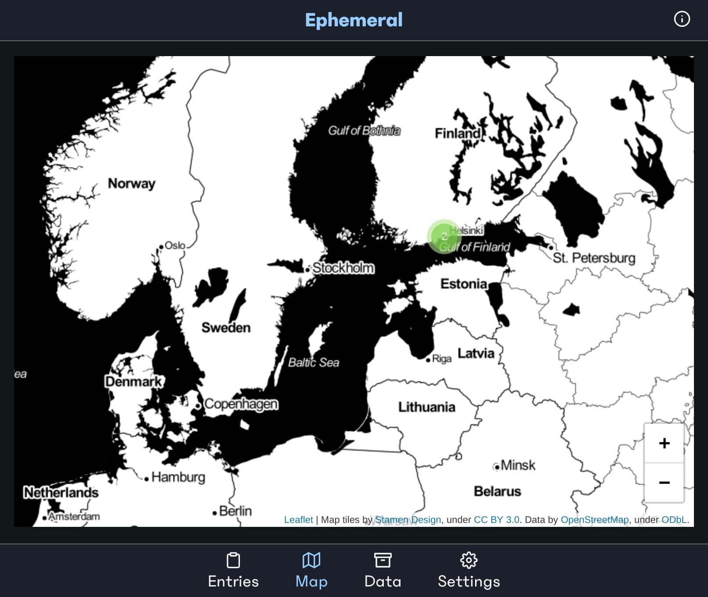

# Ephemeral

Ephemeral is a progressive web app for writing down words and their translations, as you encounter them.

The live version is at https://ephemeralnotes.app.

I made this originally when I immigrated to Finland and wanted a way to connect words with events and the world around me. I make this app in my free time.

The app works offline and all data is stored locally to your device.



## Table of Contents

1. [Features](#features)
2. [Principles](#principles)
3. [Development](#development)
4. [Production](#production)
5. [List of Technologies Used](#list-of-technologies-used)
6. [Architecture](#architecture)
7. [Contributing](#contributing)
8. [Code of Conduct](#code-of-conduct)
9. [License](#license)

## Features

- Allows you to capture notes, time, and (optionally) the location
- Works offline
- Is resilient to errors
- You can install it / add to home screen on most devices (including smartphones, desktops etc.)
- You can always export and import data, as it's stored locally

## Principles

The following principles guide the project.
Each feature or change should be evaluated against them.

### Data ownership

The application should avoid storing data in a remote location.
The user notes (including time and location) should stay on the local device.
It is up to the user to export them and share them however they want.

Note that this has implications for the architecture; many server-side solutions are not possible. That fact should be communicated to the user.

### Accessibility

People use the web in different ways, and we should accommodate them.

The Web Content Accessibility Guidelines 2.1 ([WCAG 2.1](https://www.w3.org/TR/WCAG21/)) cover a number of criteria to consider when putting things online. We should strive for level AA, or even AAA.

In practice, this means evaluating the markup that we put on the page, validating our assumptions about interactions, and ensuring that states are communicated correctly. Where such choices are made, we should document the reasoning and share references.

### Performance

Not everyone has expensive, fast devices.
In fact, [as a trend, it appears that computing has gotten cheaper, not faster](https://infrequently.org/2017/10/can-you-afford-it-real-world-web-performance-budgets/).
A median device can still run slow if overloaded with Javascript.
We should aim to deliver the experience in the amount of JS needed, and no more.

This has implications for the choice of technology, feature set and testing.
For example, Elm allows us to have very small and perfomant bundles.
Similarly, using Web Components and ports for more specialized APIs (maps, storage persistence) allow us to use tested implementations, without rolling our own potentially heavy and unreliable ones.

### Don't give up on the user

An application that works locally can fail in many ways. We should inform the user why things failed, whether it is expected, and whether they can do anything about it (even if it means trying again later!).

For example, Geolocation can fail, data can get corrupted, the user might change the contents, or a service worker might be waiting to update. We should be honest about those possibilities, and architect the code in a way that will prompt us to communicate these to the user.

### Document why

This is partially covered by the above.
Where code is concerned, we should strive to document why a certain decision was made.

Was a certain CSS order needed to progressively enhance features? Did we elect a specific markup pattern to expose features to Assistive Technologies? Were there compromises or assumptions in any of them? These are the kind of things we should document.

## Development

To start, you will need to [install Node.js](TODO) and [npm](). Node is a runtime for Javascript that works outside of the browser. NPM allows us to install packages (shared libraries) for Node. Both of them are used to set up development tooling.

Then, in a terminal:

```shell
npm ci
npm run dev
```

This will start a local server at http://localhost:8080.
You can visit that page to see the application running.
It will reload automatically as you make changes.

If you want more information on how exactly the application files and assets are built, [check out the docs/build.md](docs/build.md) file.

## Production

For production, we have to build the application and deploy it to a public location.

Building the application is done with:

```shell
npm run build
```

This places the built files under `dist/`

The deployment is handled automatically through the [Now for GitHub integration](https://zeit.co/github). It is not something that normally you would need to do if making a Pull Request.

That said, if you want to run the app in production mode (which applies some optimisations), you can run:

```shell
npm run prod
```

This will start a server at http://localhost:5000.

Finally, if you need the closest to production parity, which includes routes and cache headers in the server response, you can use [now dev](https://zeit.co/docs/v2/development/basics) via:

```shell
npm install -g now
now dev
```

This can be useful if you want to debug the full server round-trips, as well as the Service Worker caching.

## List of Technologies Used

If you are interested in contributing, you will see many of the following terms and libraries.
We introduce them here to establish a common starting point.

[Elm](https://elm-lang.org/) is a delightful language for reliable web apps.
We use it for the core UI and data architecture.
Elm enables us to express our interface as a function of data.
It also helps us handle error cases in the code, in a way that is resilient and can be expressed to the user in an actionable way.

A Progressive Web App (PWA) works offline via a Service Worker. A Service Worker is a script that runs in the browser detached from the website, and caches assets and other scripts. A PWA can be installed locally, on most devices. [Here is an intro to PWAs, by Google](https://developers.google.com/web/progressive-web-apps/).

Service Workers are a rather low-level API. To make them more declarative, and to manage the asset invalidation when they change, we use [Workbox](https://developers.google.com/web/tools/workbox/).

For storage, Ephemeral uses [IndexedDB](https://developer.mozilla.org/en-US/docs/Web/API/IndexedDB_API), which is a local, persisted database in the browser.
IndexedDB is built-in to browsers, and exposes a number of low-level interfaces.
To make that more manageable, we use [idb](https://github.com/jakearchibald/idb), which is a library that wraps IndexedDB in promises, and tries to expose errors more consistently.

For maps, we use [Leaflet](https://leafletjs.com/). Leaflet is a well-established JS library for rendering maps and features on them.

In order to integrate Elm with more complex UI, like the Leaflet map, we use the set of technologies called [Web Components](https://developer.mozilla.org/en-US/docs/Web/Web_Components). They allow us to wrap UI in a way that Elm can render declaratively, but that keep internal details and handlers.

For parts where we would interface with Javascript, we use [TypeScript](https://www.typescriptlang.org/), a typed superset of Javascript. It offers a type system aimed to model Javascript's behaviour. Keep in mind, the type system is different to Elm's, but nonetheless it helps us type the boundaries between parts of the application.

## Architecture

### The Index

The application has the entry point `index-dev.ts` or `index-prod.ts`, depending on the environment.

The index is responsible for importing the parts of the application.
They are :

- The Core Elm Application (imported statically)
- The Leaflet Web Component (imported dynamically)
- Information UI components (imported dynamically)

### The Core Elm Application and Ports

The core Elm application is initialised from `src/client.ts`.

It does the following:

- Sets up the flags (some initial configuration) for the Elm application
- Attaches the Elm application to the DOM
- Sets up listeners for each port; ports are the way in which Elm communicates to JS

#### The Elm Application Internals

**NOTE**: Before you read this section, I recommend [going through the official Elm guide](https://guide.elm-lang.org/architecture/). It establishes a lot of the concepts used below :)

The Elm application entry point is `src/Main.elm`.
Main imports each `Page/*.elm` module, and handles the routing to each one.
Each Page module might have its own internal `model`, `update`, `view` and `subscriptions`.
Main ensures that each Page's functions are connected correctly, and that they get the data they need.

Some pages might need data from a top-level shared model, such as the list of Entries that the user has stored. We tentatively call this `Context`, but other names and ways to do this, such as [SharedState](https://github.com/ohanhi/elm-shared-state), exist as well.

If you want to go through the application, my recommendation would be to start the Page module you are interested in, and then work up or down from there. You could also start at Main, but your mileage may vary.

Apart from Page modules, the rest is centered around data types.
For example, the `Entry.elm` module defines the `Entry` type. An Entry has some internal structure, and some exposed functions to work with it. It also establishes some functions to encode into and decode from JSON. This is useful when we need to communicate with JS through ports, or when we write to a file.

#### Ports

Ports are used to communicate with JS. There are a few things that we handle with port modules:

- Saving and fetching things from the IndexedDB Store
- Setting user preferences for Dark Mode
- Geolocation
- Handling notifications of Service Worker updates and Installation

These are usually in paired TypeScript and Elm modules. Thus, we have `Store.elm`/`Store.ts`, `DarkMode.elm`/`DarkMode.ts` and so on.

An important decision here, is that each module has only two ports, `fromElm` and `toElm`.
This enforces all the data to pass through a common interface, and makes it clear that there are no request/response relationships between Elm and JS. Something in JS/TS could fail to respond altogether, and we should be prepared for it.

For each pair, then:

- An Elm module, say `Store.elm`, establishes functions to send messages to JS (`FromElm`). It also establishes messages it can process from JS (`ToElm`).
- Each Typescript module, say `Store.ts`, then has a `handleSubMessage` function. It can do arbitrary things with the message, such as going to the database, or just logging to the console. It gets passed a `sendToElm` function, that it can use to send a `ToElm` message.
- On the Elm module, any Page (or Main) that wants to use messages from JS, declares it in the `sub` (subscription) function.

This approach has a little bit more typing, and encoding/decoding.
However, given the [Principles](#principles) outlined above, creating a more strict boundary seems important for a resilient application.

### The Leaflet Web Component

The Leaflet Web Component is one of the more interesting bits of interop here.
Leaflet is a fantastic library, and it has a heavy OOP and imperative API.

To add a marker to leaflet, you:

- Create a layer
- Add the feature to the layer
- Add the layer to the map, if not already there
- Bind the popup content of the feature, if any

Alongside that, Leaflet wants undisturbed access to its section of the DOM.
This clashes with Elm though, which in our case controls the entire `body`, and would try to diff things. (This is all working as intended btw, I think it makes sense).

We could try to do all this with ports. In fact, I tried it in the past, but it was messy.
A different way I wanted to take was to use a Web Component.

In an ideal world, I'd like to render the following from Elm, and get a Leaflet map:

```html
<leaflet-map defaultLatitude="23.93" defaultLongitude="60.16">
  <leaflet-marker latitude="23.93" longitude="60.16">
    <p>Hello, I have HTML content in a popup!</p>
  </leaflet-marker>
</leaflet-map>
```

Web components allow us to get exactly that. We tie the imperative behaviour to changes in the DOM (a process manual, but workable). Then we add the real Leaflet map to an "internal" DOM, or Shadow DOM. As far as Elm is concerned it is only diffing the top-level `<leaflet-map>` and `<leaflet-marker>`, unaware of the "internal" DOM that Leaflet is happy to make changes to.

For me, this pairing of Elm (which will respect custom elements) and Web Components is great, especially when it comes to rendering UI! You could also use Web Components for more JS/Elm communication through Custom Events, but I find ports a cleaner boundary for that.

If you want to see the small mess of setting this up, check out `src/leaflet/leaflet-map.ts`.

## Contributing

If you are interested in contributing, please [consult CONTRIBUTING.md](/CONTRIBUTING.md) for how to do so. That document covers topics such as opening issues, creating PRs, running tests, as well as the principles and code of conduct.

## Code of Conduct

## License

Mozilla Public License Version 2.0
